# 前言

​	本节的内容是介绍CMSIS中的RTOS接口以及STM32CubeMX中可以配置的RTOS的参数。

# 1. CMSIS

## 1.1 CMSIS手册

​		[CMSIS Introduction](https://arm-software.github.io/CMSIS_5/General/html/index.html)

​	我们已经将CMSIS的官方仓库下载下来放到了目录**rtos_doc_source\RTOS培训资料\00_基础资源资料\4_ARM架构通用资料**中：

|  |
| :----------------------------------------: |

## 1.2 CMSIS简介

​	什么是CMSIS？它包含了哪些东西？支持什么设备？RTOS和它又是什么关系？

* 什么是CMSIS？

  CMSIS的英文全称是：Common Microcontroller Software Interface Standard，直译过来就是“通用微控制器软件接口标准”。它是一个用来让微控制器开发者减少学习时间、简化软件移植、加速工程创建仿真和加速应用产品上架的工具集合。

* CMSIS的组成

|                        CMSIS                        | 处理对象                                                     | 描述                                                         |
| :-------------------------------------------------: | :----------------------------------------------------------- | ------------------------------------------------------------ |
|                       Core(M)                       | All Cortex-M, SecurCore                                      | Standardized API for the Cortex-M processor core and peripherals. Includes intrinsic functions for Cortex-M4/M7/M33/M35P SIMD instructions. |
|                       Core(A)                       | Cortex-A5/A7/A9                                              | Standardized API and basic run-time system for the Cortex-A5/A7/A9 processor core and peripherals. |
|                       Driver                        | All Cortex                                                   | Generic peripheral driver interfaces for middleware. Connects microcontroller peripherals with middleware that implements for example communication stacks, file systems, or graphic user interfaces. |
|                         DSP                         | All Cortex-M                                                 | DSP library collection with over 60 functions for various data types: fixed-point (fractional q7, q15, q31) and single precision floating-point (32-bit). Implementations optimized for the SIMD instruction set are available for Cortex-M4/M7/M33/M35P. |
|                         NN                          | All Cortex-M                                                 | Collection of efficient neural network kernels developed to maximize the performance and minimize the memory footprint on Cortex-M processor cores. |
| RTOS V1  | Cortex-M0/M0+/M3/M4/M7 | Common API for real-time operating systems along with a reference implementation based on RTX. It enables software components that can work across multiple RTOS systems. |
| RTOS V2 | All Cortex-M, Cortex-A5/A7/A9 | Extends CMSIS-RTOS v1 with Armv8-M support, dynamic object creation, provisions for multi-core systems, binary compatible interface. |
|                        PACK                         | All Cortex-M, SecurCore, Cortex-A5/A7/A9                     | Describes a delivery mechanism for software components, device parameters, and evaluation board support. It simplifies software re-use and product life-cycle management (PLM). |
|                        Build                        | All Cortex-M, SecurCore, Cortex-A5/A7/A9                     | A set of tools, software frameworks, and work flows that improve productivity, for example with Continuous Integration (CI). |
|                         SVD                         | All Cortex-M, SecurCore                                      | Peripheral description of a device that can be used to create peripheral awareness in debuggers or CMSIS-Core header files. |
|                         DAP                         | All Cortex                                                   | Firmware for a debug unit that interfaces to the CoreSight Debug Access Port. |
|                        Zone                         | All Cortex-M                                                 | Defines methods to describe system resources and to partition these resources into multiple projects and execution areas. |

​	CMSIS包含了这12个软件包，支持Cortex-M内核和Cortex-A内核处理器的多种外设，我们本次最关心的RTOS也在其中，并且有两个版本。从他们的描述可以看出，V2是在V1的基础上扩展的，既支持M内核也支持A内核。所以在兼容性上，V2版本的RTOS更强。

## 1.3 CMSIS-RTOS API

​	CMSIS接口和应用层以及RTOS层之间的关系如图：

|  |
| :---------------------------------------------: |

​	它将RTOS层的一些API又做了一层封装，目的是为了兼容多种RTOS，最下层的第三方的**Real Time Kernel**可以是FreeRTOS、RT-Thread，也可以是ucos等其它实时操作系统，我们这里主要应用的是FreeRTOS。

​	鉴于CMSIS-RTOS V2版本的兼容性更强，且是在V1版本的基础上进行的修改完善，所以我们重点来看下V2版本的API，然后对于和V1版本API有差异的地方再特别关注一下。

​	另外需要注意的是，CMSIS-RTOS中的API对于不同的RTOS内核，并不是都实现了封装，可能有些API对于FreeRTOS实现了封装可以让开发者调用，但是对于RT-Thread却没有实现封装，也就无法调用。

### **1.3.1 内核信息和控制函数**

| 函数名                       | 参数说明                                                     | 返回值                                                       | 功能描述                                                     | 对比V1                                                  |
| ---------------------------- | ------------------------------------------------------------ | ------------------------------------------------------------ | ------------------------------------------------------------ | ------------------------------------------------------- |
| **osKernelGetInfo**          | **version**：用于检索版本信息的缓冲区指针； **id_buf**：用于检索内核ID字符串的缓冲区指针； **id_size**：内核ID字符串的大小； | ***osOK***:成功 ***osError***:错误                        | 获取内核的版本信息                                           | V1版本没有此函数                                        |
| **osKernelGetState**         | \                                                            | ***osKernelError***:错误 ***其他状态***                   | 获取当前的内核状态                                           | 替换了V1的**osKernelRunning**函数                       |
| **osKernelGetSysTimerCount** | \                                                            | 当前系统定时器的计数值                                       | 获取当前系统定时器的计数值                                   | V1版本没有此函数                                        |
| **osKernelGetSysTimerFreq**  | \                                                            | 当前系统定时器的频率                                         | 获取系统定时器的品牌v                                        | 代替了V1的宏定义**osKernelTickMicroSec**                |
| **osKernelInitialize**       | \                                                            | ***osOK***:成功 ***osError* **：错误 **osErrorISR** ：中断服务函数产生的错误 ***osErrorNoMemory* **：内存错误 | 初始化RTOS内核                                               | 对比V1返回值类型从***osStatus***变成了***osStatus_t *** |
| **osKernelLock**             | \                                                            | ***1***：已锁 ***0***：未锁 ***负数***：错误代码       | 返回上一次进程上锁状态                                       | V1没有此函数                                            |
| **osKernelUnlock**           | \                                                            | ***1***：已锁 ***0***：未锁 ***负数***：错误代码       | 返回上一次进程上锁状态                                       | V1没有此函数                                            |
| **osKernelRestoreLock**      | ***lock***：上锁状态                                         | 新的上锁状态： ***1***：已锁 ***0***：未锁 ***负数***：错误代码 | 恢复在lock或者unlock前的上锁状态                             | V1没有此函数                                            |
| **osKernelSuspend**          | \                                                            | 内核进入休眠或低功耗的时间                                   | 返回值代表的是内核还有这么多个tick就会进入休眠或者低功耗模式 | V1没有此函数                                            |
| **osKernelResume**           | **sleep_ticks**:内核处于休眠或低功耗模式的时间               | \                                                            | 重启内核                                                     | V1没有此函数                                            |
| **osKernelStart**            | \                                                            | **osStatus_t**                                               | 启动内核                                                     | 对比V1返回值类型从***osStatus***变成了***osStatus_t *** |
| **osKernelGetTickCount**     | \                                                            | **uint32_t**                                                 | 获取当前内核的计数值                                         | V1没有此函数                                            |
| **osKernelGetTickFreq**      | \                                                            | **uint32_t**                                                 | 内核时钟的频率                                               | 替换V1的**osKernelTickMicroSec**                        |

### **1.3.2 线程管理**

| 函数名                    | 参数说明                                                     | 返回值                                | 功能描述                                                     | 对比V1                                               |
| ------------------------- | ------------------------------------------------------------ | ------------------------------------- | ------------------------------------------------------------ | ---------------------------------------------------- |
| **osThreadDetach**        | ***thread_id***：线程ID                                      | **osStatus_t**：状态值                | 分离一个线程                                                 | V1没有此函数                                         |
| **osThreadEnumerate**     | ***thread_array***：指向检索线程ID的数组的指针 ***array_items***：要检索线程的最大个数 | **uint32_t**：检索到的线程的实际个数  | 枚举线程                                                     | V1没有此函数                                         |
| **osThreadExit**          | \                                                            | \                                     | 退出线程                                                     | V1没有此函数                                         |
| **osThreadGetCount**      | \                                                            | **uint32_t** ：处于激活状态的线程个数 | 获取线程个数                                                 | V1没有此函数                                         |
| **osThreadGetId**         | \                                                            | **osThreadId_t**:线程ID               | 获取当前线程的ID                                             | 返回值类型从***osThreadId***变成了***osThreadId_t*** |
| **osThreadGetName**       | ***thread_id***：某个线程的ID                                | **const char \***：返回线程名称       | 获取某个ID线程的名称                                         | V1没有此函数                                         |
| **osThreadGetPriority**   | ***thread_id***：某个线程的ID                                | **osPriority_t** ：线程优先级         | 返回指定线程的优先等级                                       | 形参和返回值类型发生了变化                           |
| **osThreadGetStackSize**  | ***thread_id***：某个线程的ID                                | **uint32_t** ：堆的大小               | 获取指定线程的堆大小                                         | V1没有此函数                                         |
| **osThreadGetStackSpace** | ***thread_id***：某个线程的ID                                | **uint32_t** ：剩余的堆大小           | 获取指定线程的剩余的堆空间大小                               | V1没有此函数                                         |
| **osThreadGetState**      | ***thread_id***：某个线程的ID                                | **osThreadGetState** ：线程的状态     | 获取指定线程的状态                                           | V1没有此函数                                         |
| **osThreadJoin**          | ***thread_id***：某个线程的ID                                | **osStatus_t** ：事件状态和错误码     | 结合某个指定的线程                                           | V1没有此函数                                         |
| **osThreadNew**           | ***func***：线程函数 ***argument***：传递给线程函数的开始参数 ***attr* **：线程属性，默认是NULL | **osThreadId_t**：线程ID              | 新建一个线程且将其加入到激活线程的列表中并设置为准备状态     | 代替V1的**osThreadCreate**                           |
| **osThreadResume**        | ***thread_id***：某个线程的ID                                | **osStatus_t** ：事件状态和错误码     | 将指定线程恢复为准备状态                                     | V1没有此函数                                         |
| **osThreadSetPriority**   | ***thread_id***：某个线程的ID ***priority* **:优先级      | **osStatus_t** ：事件状态和错误码     | 设置指定线程的优先等级                                       | 形参和返回值类型发生了变化                           |
| **osThreadSuspend**       | ***thread_id***：某个线程的ID                                | **osStatus_t** ：事件状态和错误码     | 暂停指定的线程                                               | V1没有此函数                                         |
| **osThreadTerminate**     | ***thread_id***：某个线程的ID                                | **osStatus_t** ：事件状态和错误码     | 终止指定的线程                                               | 形参和返回值类型发生了变化                           |
| **osThreadYield**         | \                                                            | **osStatus_t** ：事件状态和错误码     | 将控制权交给下一个处于准备状态的同一优先等级的线程，如果没有相同优先级的处于准备状态的线程，那么当前线程继续执行 | 返回值类型发生了变化                                 |

### **1.3.3 线程标志**

| 函数名                 | 参数说明                                                     | 返回值                                      | 功能描述               | 对比V1       |
| ---------------------- | ------------------------------------------------------------ | ------------------------------------------- | ---------------------- | ------------ |
| **osThreadFlagsSet**   | ***thread_id***：某个线程的ID ***flags***：线程的标志值   | **uint32_t** ：设置好之后的标志值或者错误码 | 设置指定线程的标志值   | V1没有此函数 |
| **osThreadFlagsClear** | ***flags***：线程的标志值*                                   | **uint32_t** ：清除前的标志值或错误码       | 清除指定线程的某个标志 | V1没有此函数 |
| **osThreadFlagsGet**   | \                                                            | **uint32_t**：当前线程的标志值              | 获取当前线程的标志值   | V1没有此函数 |
| **osThreadFlagsWait**  | ***flags***：线程的标志值 ***options***：指定的操作 ***timeout***：等待的延时时间 | **uint32_t**：当前线程的被清除前的标志值    | 等待某个标志值         | V1没有此函数 |

### **1.3.4 事件标志**

| 函数名                  | 参数说明                                                     | 返回值                               | 功能描述                   | 对比V1       |
| ----------------------- | ------------------------------------------------------------ | ------------------------------------ | -------------------------- | ------------ |
| **osEventFlagsGetName** | ***ef_id***：事件标志的ID                                    | **const char \***：事件标志的名称    | 获取指定事件的名称         | V1没有此函数 |
| **osEventFlagsNew**     | ***attr***：事件的属性                                       | **osEventFlagsId_t**：事件的ID       | 新建并初始化一个事件       | V1没有此函数 |
| **osEventFlagsDelete**  | ***ef_id***：事件标志的ID                                    | **osStatus_t** ：事件状态和错误码    | 删除指定的事件             | V1没有此函数 |
| **osEventFlagsSet**     | ***ef_id***：事件标志的ID ***flags***：待设置的事件标志值 | **uint32_t**：设置之后的事件的标志值 | 设置指定事件的标志值       | V1没有此函数 |
| **osEventFlagsClear**   | ***ef_id***：事件标志的ID ***flags***：待清除的事件标志值 | **uint32_t**：清除之前的事件的标志值 | 清除指定事件的标志值       | V1没有此函数 |
| **osEventFlagsGet**     | ***ef_id***：事件标志的ID                                    | **uint32_t**：当前事件的标志值       | 获取当前事件的标志值       | V1没有此函数 |
| **osEventFlagsWait**    | ***ef_id***：事件标志的ID ***flags***:等待的标志值 ***options***:等待的操作方式 ***timeout***：等待的超时事件 | **uint32_t**：事件的标志值           | 等待某个时间的某个标志为真 | V1没有此函数 |

### **1.3.5 通用延时函数**

| 函数名           | 参数说明                          | 返回值                            | 功能描述                              | 对比V1             |
| ---------------- | --------------------------------- | --------------------------------- | ------------------------------------- | ------------------ |
| **osDelay**      | ***ticks***：延时时间，单位是tick | **osStatus_t** ：事件状态和错误码 | 相对延时ticks个单位                   | 返回值类型名字变了 |
| **osDelayUntil** | ***ticks***：延时时间，单位是tick | **osStatus_t** ：事件状态和错误码 | 延时到一个绝对时间，周期是ticks个单位 | V1没有此函数       |

### 1.3.6 定时器管理

| 函数名               | 参数说明                                                     | 返回值                                         | 功能描述                                 | 对比V1                               |
| -------------------- | ------------------------------------------------------------ | ---------------------------------------------- | ---------------------------------------- | ------------------------------------ |
| **osTimerDelete**    | ***timer_id***：定时器ID                                     | **osStatus_t** ：事件状态和错误码              | 删除指定的定时器                         | 形参类型和返回值类型的名字发生了变化 |
| **osTimerGetName**   | ***timer_id***：定时器ID                                     | ***const char \***：定时器名字的缓冲区指针     | 获取指定定时器的名字                     | 形参类型和返回值类型的名字发生了变化 |
| **osTimerIsRunning** | ***timer_id***：定时器ID                                     | **uint32_t**： 0——>没有运行 1——>正在运行 | 获取指定定时器的状态                     | V1没有此函数                         |
| **osTimerNew**       | ***func***：指向回调函数 ***type***：osTimerOnce/*osTimerPeriodic*  ***argument***：传给回调函数的参数 ***attr*** :定时器属性 | **osTimerId_t**：定时器的ID                    | 新建一个定时器                           | 代替V1的**osTimerCreate**            |
| **osTimerStart**     | ***timer_id***：定时器ID ***ticks***：定时器的计数周期    | **osStatus_t** ：事件状态和错误码              | 让指定的定时器开始运行，周期位tick个单位 | 形参类型和返回值类型的名字发生了变化 |
| **osTimerStop**      | ***timer_id***：定时器ID                                     | **osStatus_t** ：事件状态和错误码              | 让指定的定时器停止运行                   | 形参类型和返回值类型的名字发生了变化 |

### **1.3.7 互斥量管理**

| 函数名              | 参数说明                                           | 返回值                                         | 功能描述                                     | 对比V1                               |
| ------------------- | -------------------------------------------------- | ---------------------------------------------- | -------------------------------------------- | ------------------------------------ |
| **osMutexAcquire**  | ***mutex_id***：互斥量ID ***timeout***:超时时间 | **osStatus_t** ：事件状态和错误码              | 等待指定的互斥量可以被访问，会阻塞任务或线程 | 代替V1的**osMutexWait**              |
| **osMutexDelete**   | ***mutex_id***：互斥量ID                           | **osStatus_t** ：事件状态和错误码              | 删除指定的互斥量                             | 形参类型和返回值类型的名字发生了变化 |
| **osMutexGetName**  | ***mutex_id***：互斥量ID                           | ***const char \***：保存互斥量名字的缓冲区指针 | 获取指定互斥量的名字                         | V1没有此函数                         |
| **osMutexGetOwner** | ***mutex_id***：互斥量ID                           | ***osThreadId_t***：线程ID                     | 获取指定互斥量所在线程的ID                   | V1没有此函数                         |
| **osMutexNew**      | ***attr***：互斥量的属性，默认是NULL               | **osMutexId_t**：互斥量的ID                    | 新建一个互斥量并初始化它返回一个ID           | 代替V1的**osMutexCreate**            |
| **osMutexRelease**  | ***mutex_id***：互斥量ID                           | **osStatus_t** ：事件状态和错误码              | 释放指定的互斥量                             | 形参类型和返回值类型的名字发生了变化 |

### **1.3.8 信号量**

| 函数名                  | 参数说明                                                     | 返回值                                    | 功能描述                       | 对比V1                               |
| ----------------------- | ------------------------------------------------------------ | ----------------------------------------- | ------------------------------ | ------------------------------------ |
| **osSemaphoreAcquire**  | ***semaphore_id***：信号量的ID ***timeout***：超时时间    | **osStatus_t** ：事件状态和错误码         | 等待指定的信号量可访问         | 代替V1的**osSemaphoreWait**          |
| **osSemaphoreDelete**   | ***semaphore_id***：信号量的ID                               | **osStatus_t** ：事件状态和错误码         | 删除指定的信号量               | 形参类型和返回值类型的名字发生了变化 |
| **osSemaphoreGetCount** | ***semaphore_id***：信号量的ID                               | **uint32_t** :可获取的信号量个数          | 获取指定信号量中可获取的信号   | V1没有此函数                         |
| **osSemaphoreGetName**  | ***semaphore_id***：信号量的ID                               | **const char \***：信号量名称的缓冲区指针 | 获取指定信号量的名字           | V1没有此函数                         |
| **osSemaphoreNew**      | ***max_count***：此信号量最多可创建的信号个数 ***initial_count***：对创建的信号需要初始化的个数 ***attr***：信号量的属性，默认是NULL | ***osSemaphoreId_t***：信号量的ID         | 新建一个信号量并初始化它的信号 | 代替V1的**osSemaphoreCreate**        |
| **osSemaphoreRelease**  | ***semaphore_id***：信号量的ID                               | **osStatus_t** ：事件状态和错误码         | 释放一个指定的信号量           | 形参类型和返回值类型的名字发生了变化 |

### **1.3.9 内存池**

| 函数名                       | 参数说明                                                     | 返回值                                         | 功能描述                             | 对比V1                   |
| ---------------------------- | ------------------------------------------------------------ | ---------------------------------------------- | ------------------------------------ | ------------------------ |
| **osMemoryPoolAlloc**        | ***mp_id***：内存池的ID ***timeout***：超时时间           | **void/***:分配的内存池的地址                  | 给一个指定ID的内存池分配空间         | 代替V1的**osPoolAlloc**  |
| **osMemoryPoolDelete**       | ***mp_id***：内存池的ID                                      | **osStatus_t**：事件状态和错误码               | 删除一个指定的内存池                 | V1没有此函数             |
| **osMemoryPoolFree**         | ***mp_id***：内存池的ID ***block***：内存块的地址指针     | **osStatus_t**：事件状态和错误码               | 释放内存池中的内存块                 | 代替V1的**osPoolFree**   |
| **osMemoryPoolGetBlockSize** | ***mp_id***：内存池的ID                                      | **uint32_t**:内存池中内存块的大小              | 获取内存池中内存块的大小             | V1没有此函数             |
| **osMemoryPoolGetCapacity**  | ***mp_id***：内存池的ID                                      | **uint32_t**：内存池中内存块的最大数量         | 获取内存池中内存块的最大数量         | V1没有此函数             |
| **osMemoryPoolGetCount**     | ***mp_id***：内存池的ID                                      | **uint32_t**：内存池中已经使用了的内存块的数量 | 获取内存池中被使用的内存块数量       | V1没有此函数             |
| **osMemoryPoolGetName**      | ***mp_id***：内存池的ID                                      | ***const char \****：内存池的名字缓冲区指针    | 获取指定内存池的名字                 | V1没有此函数             |
| **osMemoryPoolGetSpace**     | ***mp_id***：内存池的ID                                      | **uint32_t**：内存池中可以访问的内存块的数据量 | 获取内存池中可以访问的内存块的数据量 | V1没有此函数             |
| **osMemoryPoolNew**          | ***block_count***：内存块的数量 ***block_size***：内存块的大小 ***attr***：内存块的属性，默认是NULL | **osMemoryPoolId_t**：内存池的ID               | 新建一个内存池                       | 代替V1的**osPoolCreate** |

### **1.3.10 消息队列**

| 函数名                        | 参数说明                                                     | 返回值                                 | 功能描述                                       | 对比V1                      |
| ----------------------------- | ------------------------------------------------------------ | -------------------------------------- | ---------------------------------------------- | --------------------------- |
| **osMessageQueueDelete**      | ***mq_id***：消息队列的ID                                    | **osStatus_t**：事件状态和错误码       | 删除一个指定的消息队列                         | V1没有此函数                |
| **osMessageQueueGet**         | ***mq_id***：消息队列的ID ***msg_ptr***:从队列中获取消息的缓冲区指针 ***msg_prio***：消息优先等级的缓冲区指针或者指向NULL ***timeout***：超时时间 | **osStatus_t**：事件状态和错误码       | 从指定队列中获取一个消息并且保存到一个buffer中 | 代替V1的**osMessageGet**    |
| **osMessageQueueGetCapacity** | ***mq_id***：消息队列的ID                                    | **uint32_t**：队列中消息的最大个数     | 获取指定队列中消息的最大个数                   | V1没有此函数                |
| **osMessageQueueGetCount**    | ***mq_id***：消息队列的ID                                    | **uint32_t**：队列中消息的个数         | 获取指定队列中消息的个数                       | V1没有此函数                |
| **osMessageQueueGetMsgSize**  | ***mq_id***：消息队列的ID                                    | **uint32_t**：消息大小的最大值         | 获取指定队列中消息大小的最大值                 | V1没有此函数                |
| **osMessageQueueGetName**     | ***mq_id***：消息队列的ID                                    | ***const char \****：队列的名字        | 获取指定队列的名字                             | V1没有此函数                |
| **osMessageQueueGetSpace**    | ***mq_id***：消息队列的ID                                    | **uint32_t**：队列中可以访问的消息个数 | 获取指定队列中可以访问的消息的个数             | V1没有此函数                |
| **osMessageQueueNew**         | ***msg_count***：队列中允许的消息的最大个数 ***msg_size***：队列中允许的消息所占的最大空间 ***attr***：队列的属性 | **osMessageQueueId_t**：队列的ID       | 新建一个队列                                   | 代替V1的**osMessageCreate** |
| **osMessageQueuePut**         | ***mq_id***：消息队列的ID ***msg_ptr***：要填入队列中的消息的缓冲区指针 ***msg_prio***:消息的优先等级 ***timeout***：超时时间 | **osStatus_t**：事件状态和错误码       | 往指定队列中填入一个消息                       | 代替V1的**osMessagePut**    |
| **osMessageQueueReset**       | ***mq_id***：消息队列的ID                                    | **osStatus_t**：事件状态和错误码       | 复位指定的队列                                 | V1没有此函数                |

### 1.3.11 邮箱队列

​		在RTOS V2中，邮箱队列已经删除，由消息队列代替。

### 1.3.12 信号时间

​		在RTOS V2中，由线程标志代替。

# 2. SM32CubeMX配置FreeRTOS参数

​	由于CMSIS的RTOS接口中有V1和V2版本，STM32CubeMX中也对应做了适配，所以我们这两个版本的参数进行对比介绍。

## 2.1 Config parameters

|                        CMSIS-RTOS V1                         |                        CMSIS-RTOS V2                         |
| :----------------------------------------------------------: | :----------------------------------------------------------: |
| 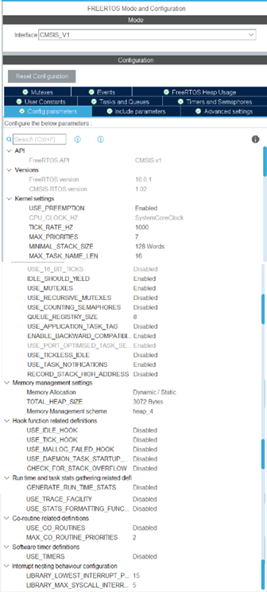 | 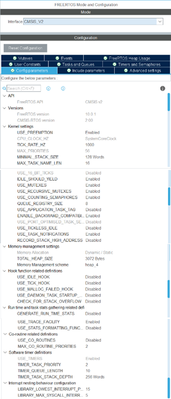 |

| CMSIS-RTOS V1                                                | CMSIS-RTOS V2                                                |
| ------------------------------------------------------------ | ------------------------------------------------------------ |
| * **FreeRTOS API：****CMSIS V1** * **FreeRTOS version：**10.0.1 * **CMSIS-RTOS version：**1.02 * **USE_PREEMPTION：**可配置，可以选择有优先级的任务调度或者无优先级的任务调度； * **CPU_CLOCK_HZ：**SystemCoreClock * **TICK_RATE_HZ：**滴答时钟频率，默认1k，可设置 * **MAX_PRIORITIES:**最大优先等级数，默认是7，**可配置**；  * **MINIMAL_STACK_SIZE：**最小堆空间，取值64~768，默认128words，可配置; * **MAX_TASK_NAME_LEN：**任务名称字符串的最大长度，范围12~255，默认16，可配置； * **USE_16_BIT_TICK：**16位滴答定时器的计数值，使能的话是16位无符号类型，不使能则是32位无符号类型，默认不使能，不可配置； * **IDLE_SHOULD_YIELD：**空闲任务让步给其它任务，使能则让步，否则不让步； * **USE_MUTEXES：**使能则在编译的时候包括互斥量功能，否则不包括，默认使能； * **USE_RECURSIVE_MUTEXES：**使能则包含递归互斥功能，否则不包含，默认不使能； * **USE_COUNTING_SEMAPHORES：**使能则包括计数信号量，否则不包含，默认不使能； * **QUEUE_REGISTRY_SIZE：**注册的队列个数，范围0~255，默认是8； * **USE_APPLICATION_TASK_TAG：**任务标签，默认不使能；这个功能是仅为高级用户设计的；  * **ENABLE_BACKWARD_COMPATIBILITY：**兼容历史版本的宏定义名称，默认使能； * **USE_PORT_OPTIMISED_TASK_SELECTION：**最优的任务执行分配，默认使能； * **USE_TICKLESS_IDLE：**空闲任务锁住tick，默认不使能； * **USE_TASK_NOTIFICATIONS：**任务通知值，默认使能； * **RECORD_STACK_HIGH_ADDRESS：**任务堆地址保存，默认不保存到TCB中； * **Memory Allocation：**内存分配，可选动态分配、静态分配或者两者皆可； * **TOTAL_HEAP_SIZE：**栈空间大小，范围512bytes~64kbytes，默认3072bytes； * **Memory Management scheme：**内存管理，有5种可选，默认使用heap_4； * **USE_IDLE_HOOK：**空闲任务钩子函数使能，默认不使能； * **USE_TICK_HOOK：**滴答钩子函数使能，默认不使能； * **USE_MALLOC_FAILED_HOOK：**内存分配失败的钩子函数使能，默认不使能； * **USE_DAEMON_TASK_STARTUP_HOOK：**守护进程的启动的钩子函数，默认不使能； * **CHECK_FOR_STACK_OVERFLOW：**检查堆溢出的钩子函数，默认不使能； * **GENERATE_RUN_TIME_STATS：**使能获取任务的运行时间，默认不使能； * **USE_TRACE_FACILITY：**使能以可视化的执行和追踪其他结构体成员和函数，默认不使能； * **USE_STATS_FORMATTING_FUNCTIONS：**搭配**USE_TRACE_FACILITY**一起使用，默认不使能； * **USE_CO_ROUTINES：**使能协同功能，默认不使能； * **MAX_CO_ROUTINE_PRIORITIES：**协同任务的最大优先等级，默认是2，范围1~255； * **USE_TIMERS：**软件定时器功能，默认不使能； * **LIBRARY_LOWEST_INTERRUPT_PRIORITY：**最低等级的中断优先等级，范围是1~15，默认15； * **LIBRARY_MAX_SYSCALL_INTERRUPT_PRIORITY：**最高的中断优先等级，范围是1~15，默认是5； | * **FreeRTOS API：****CMSIS V2** * **FreeRTOS version：**10.0.1 * **CMSIS-RTOS version：****2.00** * **USE_PREEMPTION：**可配置，可以选择有优先级的任务调度或者无优先级的任务调度； * **CPU_CLOCK_HZ：**SystemCoreClock * **TICK_RATE_HZ：**滴答时钟频率，默认1k，可设置 * **MAX_PRIORITIES：**最大优先等级数，默认是56，**不可配置**； * **MINIMAL_STACK_SIZE：**最小堆空间，取值64~768，默认128words，可配置; * **MAX_TASK_NAME_LEN：**任务名称字符串的最大长度，范围12~255，默认16，可配置； * **USE_16_BIT_TICK：1**6位滴答定时器的计数值，使能的话是16位无符号类型，不使能则是32位无符号类型，默认不使能，不可配置； * **IDLE_SHOULD_YIELD：**空闲任务让步给其它任务，使能则让步，否则不让步； * **USE_MUTEXES：**使能则在编译的时候包括互斥量功能，否则不包括，默认使能； * **USE_RECURSIVE_MUTEXES：**使能则包含递归互斥功能，否则不包含，**默认使能**； * **USE_COUNTING_SEMAPHORES：**使能则包括计数信号量，否则不包含，**默认使能**； * **QUEUE_REGISTRY_SIZE：**注册的队列个数，范围0~255，默认是8； * **USE_APPLICATION_TASK_TAG：**任务标签，默认不使能；这个功能是仅为高级用户设计的；  * **ENABLE_BACKWARD_COMPATIBILITY：**兼容历史版本的宏定义名称，默认使能； * **USE_PORT_OPTIMISED_TASK_SELECTION：**最优的任务执行分配，**默认不使能**； * **USE_TICKLESS_IDLE：**空闲任务锁住tick，默认不使能； * **USE_TASK_NOTIFICATIONS：**任务通知值，默认使能； * **RECORD_STACK_HIGH_ADDRESS：**任务堆地址保存，默认不保存到TCB中； * **Memory Allocation：**内存分配，可选动态分配、静态分配或者两者皆可； * **TOTAL_HEAP_SIZE：**栈空间大小，范围512bytes~64kbytes，默认3072bytes； * **Memory Management scheme：**内存管理，有5种可选，默认使用heap_4； * **USE_IDLE_HOOK：**空闲任务钩子函数使能，默认不使能； * **USE_TICK_HOOK：**滴答钩子函数使能，默认不使能； * **USE_MALLOC_FAILED_HOOK：**内存分配失败的钩子函数使能，默认不使能； * **USE_DAEMON_TASK_STARTUP_HOOK：**守护进程的启动的钩子函数，默认不使能； * **CHECK_FOR_STACK_OVERFLOW：**检查堆溢出的钩子函数，默认不使能； * **GENERATE_RUN_TIME_STATS：**使能获取任务的运行时间，默认不使能； * **USE_TRACE_FACILITY：**使能以可视化的执行和追踪其他结构体成员和函数，**默认使能**； * **USE_STATS_FORMATTING_FUNCTIONS：**搭配**USE_TRACE_FACILITY**一起使用，默认不使能； * **USE_CO_ROUTINES：**使能协同功能，默认不使能； * **MAX_CO_ROUTINE_PRIORITIES：**协同任务的最大优先等级，默认是2，范围1~255； * **USE_TIMERS：**软件定时器功能，**默认使能**； * **TIMER_TASK_PRIORITY：**软件定时器任务的优先等级，范围0~55，默认2； * **TIMER_QUEUE_LENGTH：**软件定时器队列长度，范围1~255，默认10； * **TIMER_TASK_STACK_DEPTH：**定时器任务堆的深度，范围128words~16384words，默认256words；  * **LIBRARY_LOWEST_INTERRUPT_PRIORITY：**最低等级的中断优先等级，范围是1~15，默认15； * **LIBRARY_MAX_SYSCALL_INTERRUPT_PRIORITY：**最高的中断优先等级，范围是1~15，默认是5； |

## 2.2 Include parameters

​		这里面的设置都是在配置文件中的宏定义开关，使能的话就会打开对应的功能，根据设计按需选择，也可以直接选择默认配置。

|                        CMSIS-RTOS V1                        |                        CMSIS-RTOS V2                        |
| :---------------------------------------------------------: | :---------------------------------------------------------: |
| 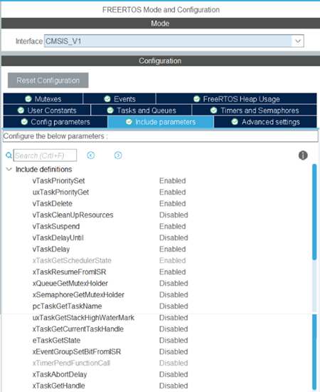 | 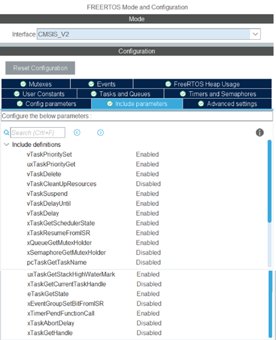 |

| CMSIS-RTOS V1                                                | CMSIS-RTOS V2                                                |
| ------------------------------------------------------------ | ------------------------------------------------------------ |
| * **vTaskPrioritySet：**设置任务优先等级，默认使能； * **uxTaskPriorityGet：**获取任务的优先等级，默认使能； * **vTaskDelete：**删除任务，默认使能； * **vTaskCleanUpResources：**资源清除，默认不使能；清除实时内核中用不到的注释； * **vTaskSuspend：**使能任务暂停功能，默认使能； * **vTaskDelayUntil：**使能delay until函数，默认不使能； * **vTaskDelay：**使能taskdelay函数，默认使能； * **xTaskGetSchedulerState：**使能xTaskGetSchedulerState()函数，默认使能，不可配置； * **xTaskResumeFromISR：**使能xTaskResumeFromISR()函数，默认使能； * **xQueueGetMutexHolder：**使能xQueueGetMutexHolder()函数，此函数在7.2.0版本有介绍，默认不使能； * **xSemaphoreGetMutexHolder：**使能xSemaphoreGetMutexHolder()函数，默认不使能； * **pcTaskGetTaskName：**使能pcTaskGetTaskName()函数，默认不使能； * **uxTaskGetStackHighWaterMark：**使能uxTaskGetStackHighWaterMark()函数，默认不使能； * **xTaskGetCurrentTaskHandle：**使能xTaskGetCurrentTaskHandle()函数，默认不使能； * **eTaskGetState：**使能xTaskGetCurrentTaskHandle()函数，默认不使能； * **xEventGroupSetBitFromISR：**使能xEventGroupSetBitFromISR()函数，默认不使能； * **xTimerPendFunctionCall：**使能xTimerPendFunctionCall()函数，默认不使能，不可配置； * **xTaskAbortDelay：**使能xTaskAbortDelay()函数，默认不使能； * **xTaskGetHandle：**使能xTaskGetHandle()函数，默认不使能； | * **vTaskPrioritySet：**设置任务优先等级，默认使能； * **uxTaskPriorityGet：**获取任务的优先等级，默认使能； * **vTaskDelete：**删除任务，默认使能； * **vTaskCleanUpResources：**资源清除，默认不使能； * **vTaskSuspend：**使能任务暂停功能，默认使能； * **vTaskDelayUntil：**使能delay until函数，默认不使能； * **vTaskDelay：**使能taskdelay函数，默认使能； * **xTaskGetSchedulerState：**使能xTaskGetSchedulerState()函数，默认使能，**可配置；**font> * **xTaskResumeFromISR：**使能xTaskResumeFromISR()函数，默认使能； * **xQueueGetMutexHolder：**使能xQueueGetMutexHolder()函数，此函数在7.2.0版本有介绍，默认不使能； * **xSemaphoreGetMutexHolder：**使能xSemaphoreGetMutexHolder()函数，默认不使能； * **pcTaskGetTaskName：**使能pcTaskGetTaskName()函数，默认不使能； * **uxTaskGetStackHighWaterMark：**使能uxTaskGetStackHighWaterMark()函数，**默认使能；** * **xTaskGetCurrentTaskHandle：**使能xTaskGetCurrentTaskHandle()函数，默认不使能； * **eTaskGetState：**使能xTaskGetCurrentTaskHandle()函数，**默认使能；** * **xEventGroupSetBitFromISR：**使能xEventGroupSetBitFromISR()函数，默认不使能； * **xTimerPendFunctionCall：**使能xTimerPendFunctionCall()函数，**默认使能，可配置；** * **xTaskAbortDelay：**使能xTaskAbortDelay()函数，默认不使能； * **xTaskGetHandle：**使能xTaskGetHandle()函数，默认不使能； |

## 2.3 Advanced settings

|                       CMSIS-RTOS V1                        |                       CMSIS-RTOS V2                        |
| :--------------------------------------------------------: | :--------------------------------------------------------: |
| 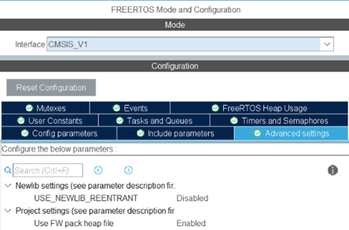 | 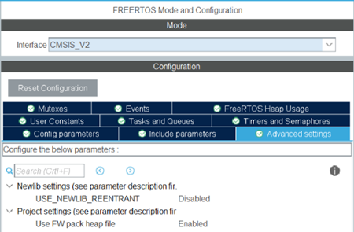 |

| CMSIS-RTOS V1                                                | CMSIS-RTOS V2                                                |
| ------------------------------------------------------------ | ------------------------------------------------------------ |
| * **USE_NEWLIB_REENTRANT：**每个任务创建的时候将分配Newlib的重入结构体，默认不使能； * **Use FW pack heap file：**使用固件包的头文件，如果不使用那么用户需要至少提供vPortFree()和pvPortMalloc()函数，默认使能； | * **USE_NEWLIB_REENTRANT：**每个任务创建的时候将分配Newlib的重入结构体，默认不使能； * **Use FW pack heap file：**使用固件包的头文件，如果不使用那么用户需要至少提供vPortFree()和pvPortMalloc()函数，默认使能； |

## 2.4 User constants

| CMSIS-RTOS V1 | CMSIS-RTOS V2 |
| :-----------: | :-----------: |
|               |               |

## 2.5 Tasks and Queues

|                        CMSIS-RTOS V1                         |                        CMSIS-RTOS V2                         |
| :----------------------------------------------------------: | :----------------------------------------------------------: |
| 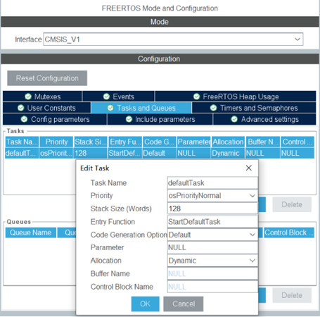  | 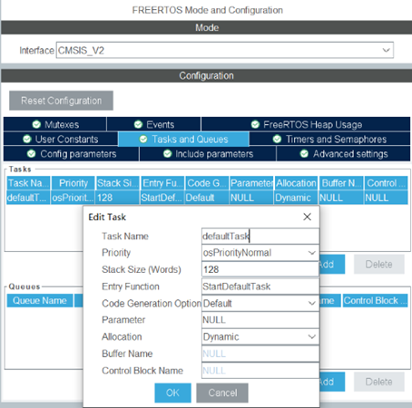 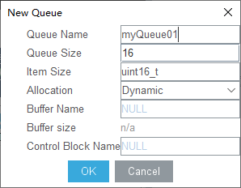 |

| CMSIS-RTOS V1                                                | CMSIS-RTOS V2                                                |
| ------------------------------------------------------------ | ------------------------------------------------------------ |
| * **添加任务：**设置名称、优先级、堆大小、入口函数、代码属性等； * **新建队列：**设置名称、队列大小、个数、动态分配或静态分配内存等； | * **添加任务：**设置名称、优先级、堆大小、入口函数、代码属性等； * **新建队列：**设置名称、队列大小、个数、动态分配或静态分配内存等； |

## 2.6 Timers and Semaphores

|                        CMSIS-RTOS V1                         |                        CMSIS-RTOS V2                         |
| :----------------------------------------------------------: | :----------------------------------------------------------: |
| 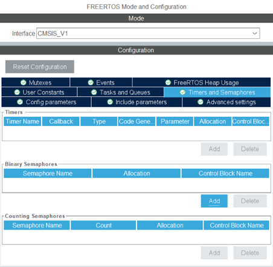 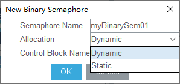 | 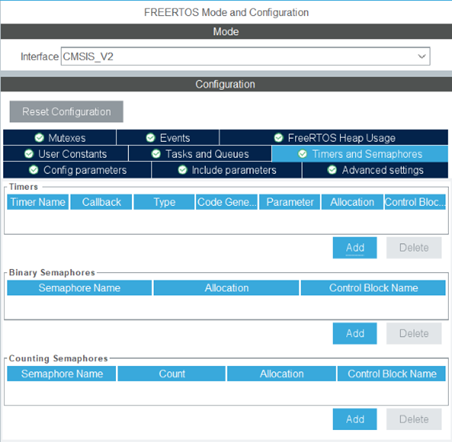 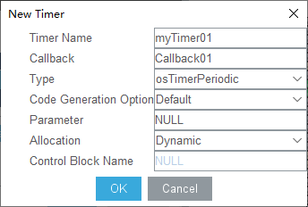 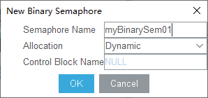 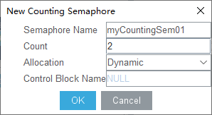 |

| CMSIS-RTOS V1                | CMSIS-RTOS V2                                  |
| ---------------------------- | ---------------------------------------------- |
| * V1版本只能添加二进制信号； | * V2版本可以添加定时器、二进制信号和计数信号； |

## 2.7 Mutexes

|                  CMSIS-RTOS V1                   |                  CMSIS-RTOS V2                   |
| :----------------------------------------------: | :----------------------------------------------: |
| 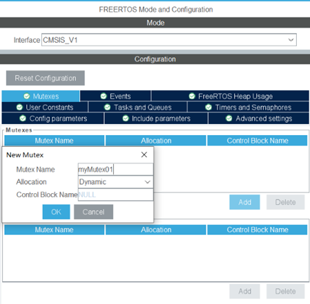 | 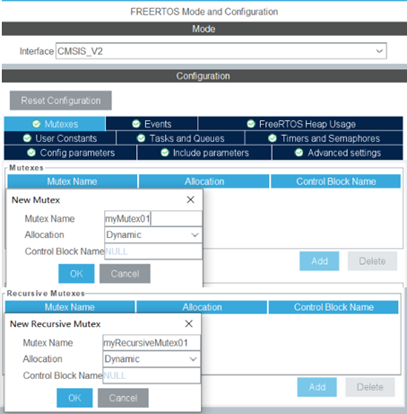 |

| CMSIS-RTOS V1                | CMSIS-RTOS V2                |
| ---------------------------- | ---------------------------- |
| * V1版本仅能添加普通互斥量； | * V2版本可以添加递归互斥量； |

## 2.8 Events

|                  CMSIS-RTOS V1                  |                  CMSIS-RTOS V2                  |
| :---------------------------------------------: | :---------------------------------------------: |
| 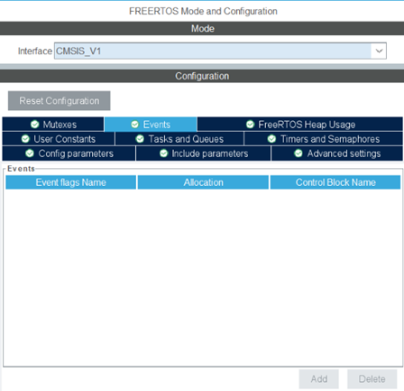 | 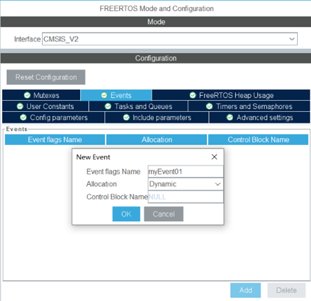 |

| CMSIS-RTOS V1        | CMSIS-RTOS V2          |
| -------------------- | ---------------------- |
| * V1版本不支持事件； | * V2版本可以添加事件； |

## 2.9 FreeRTOS Heap Usage

​		FreeRTOS的栈空间。

|                        CMSIS-RTOS V1                         |                        CMSIS-RTOS V2                         |
| :----------------------------------------------------------: | :----------------------------------------------------------: |
| 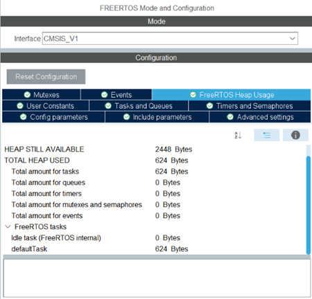 |  |

可以在此项中查看我们配置的任务、队列、定时器等总共需要多少堆栈以及它们分别各自占用了多少堆栈。