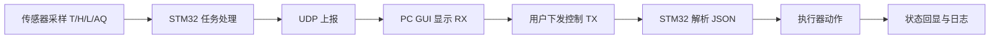
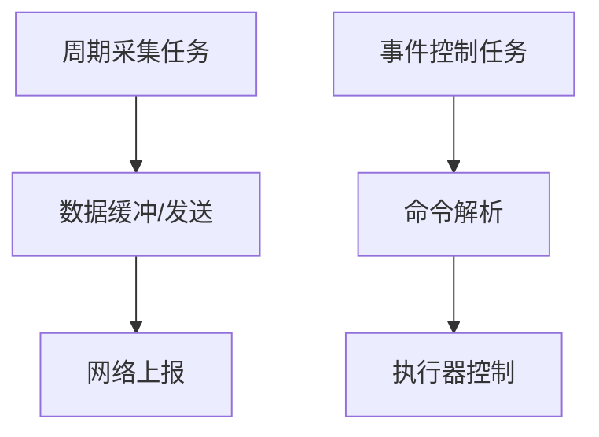
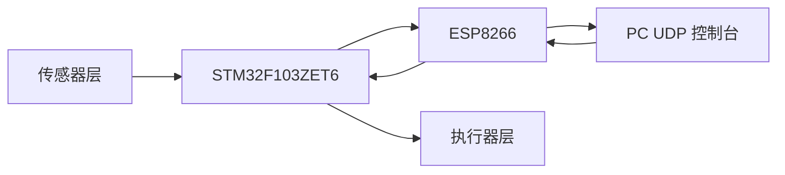
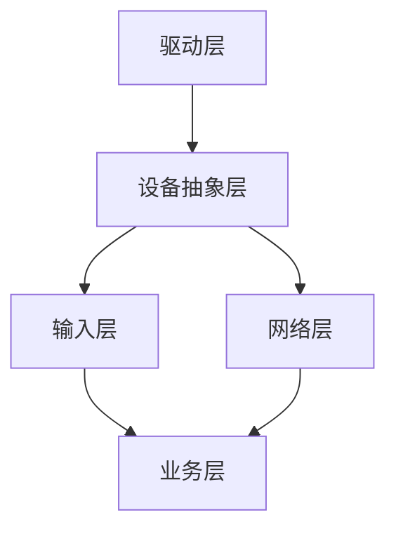
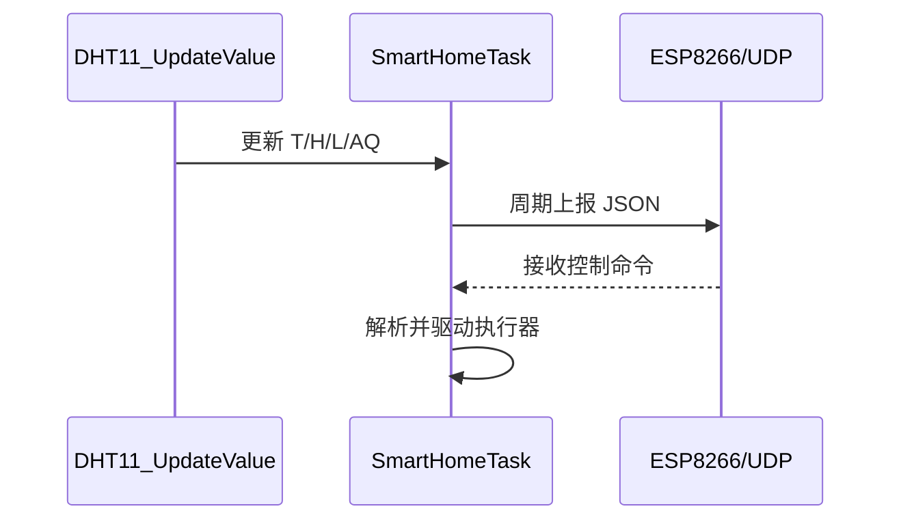
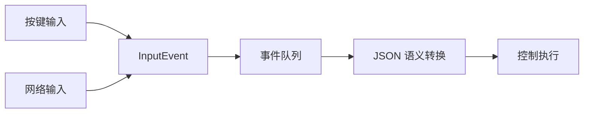
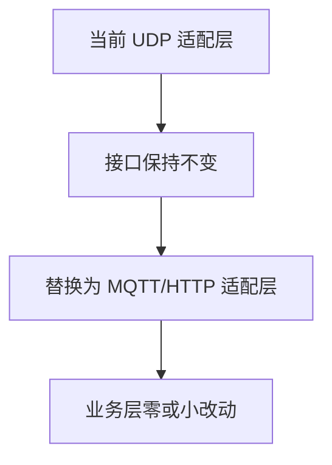
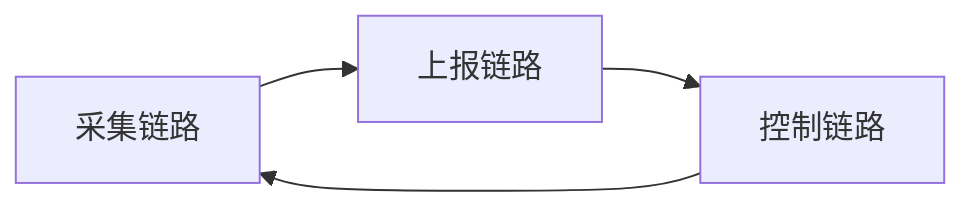

# ???????

> ??????????????????????Mermaid???????

## ??? 1?2.1.4 功能流程（可流程图化）

## ??? 2?2.2.1 实时性

## ??? 3?2.3.1 四层方案与数据闭环

## ??? 4?4.2.1 分层职责

## ??? 5?4.3.1 任务划分

## ??? 6?4.4.1 中轴机制

## ??? 7?4.9.3 替换扩展

## ??? 8?5.1.1 实现闭环

