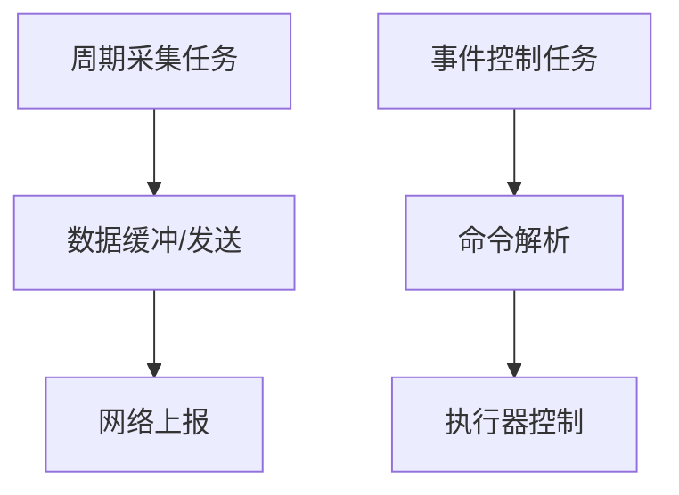
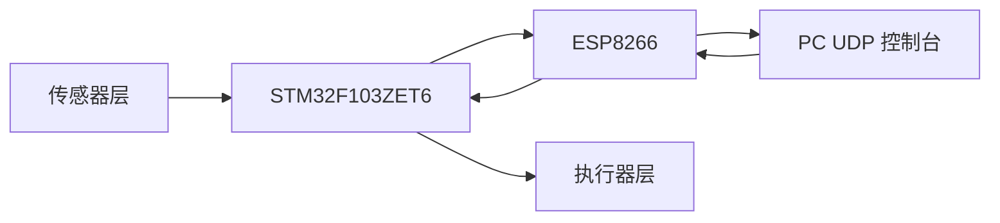
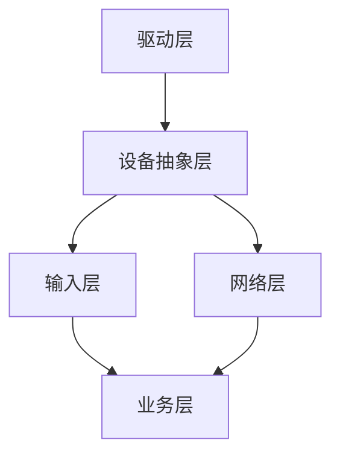
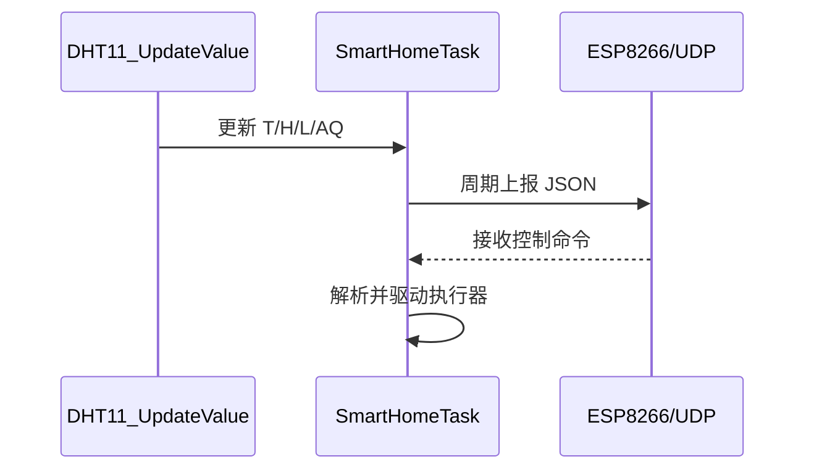
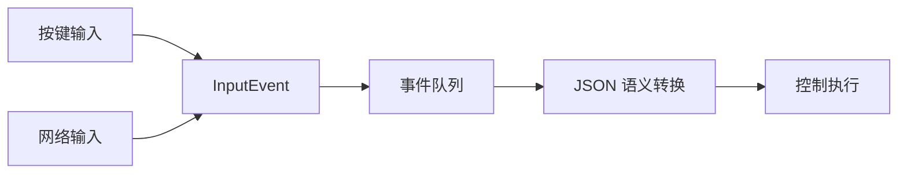
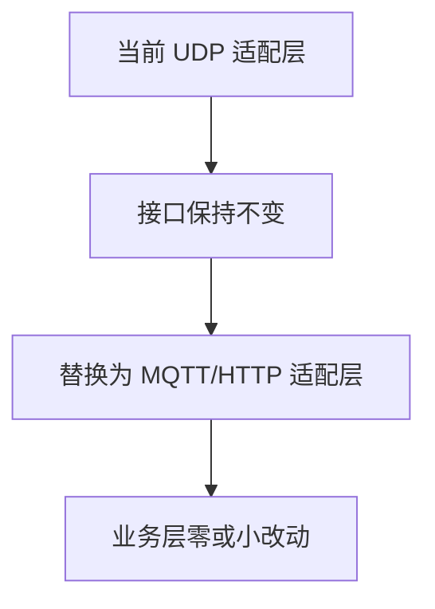

---
tags:
  - 嵌入式
  - FreeRTOS
  - STM32F103ZET6
  - 论文改写稿
---

# 基于 FreeRTOS 的室内环境远程监测与控制系统研究与实现（查重友好改写稿）

# Research and Implementation of an Indoor Environmental Remote Monitoring and Control System Based on FreeRTOS

---

## 摘要

随着智能家居应用从“单设备控制”向“多设备协同与环境联动”持续演进，用户对系统实时性、可维护性与可扩展性的要求不断提高。传统单片机项目在功能规模较小时通常采用前后台或循环轮询结构，但在同时接入多类传感器、网络通信模块、显示模块以及执行器时，程序常出现阻塞、耦合、调试困难等问题。围绕上述工程痛点，本文以 STM32F103ZET6 为核心控制器，构建了一套基于 FreeRTOS 的室内环境远程监测与控制系统。系统在功能层面实现温湿度、光照状态与空气质量数据采集，支持局域网 UDP 实时上报，并通过 PC 图形界面完成远程控制命令下发与闭环验证；在结构层面采用分层化与任务化的软件架构，将输入、网络、设备、显示与业务逻辑进行解耦，显著提升了工程可维护性。

本文工作重点不在复杂硬件堆叠，而在软件工程方法落地。通过对“需求拆解—架构设计—接口抽象—任务调度—联调修复—验收沉淀”全过程进行组织，形成了可复现的开发路径。实现中以输入事件队列作为系统信息中轴，使用 JSON 作为统一控制参数格式，使按键输入与网络输入在业务层具备一致语义；并在网络链路中引入超时策略优化、任务时序修复等措施，解决了实际调试中的建链失败、句柄时序等问题。最终系统可稳定输出串口环境信息（T/H/L/A），可持续向上位机发送结构化数据（T/H/L/AQ），并正确执行灯光、风扇及联动模式控制指令。

实验与联调结果表明，该系统在课程设计与毕业设计场景下具备良好的实用价值，能够满足“可采集、可上传、可远控、可演示”的目标。本文提出的软件流程与框架方法也可迁移到同类型中小型嵌入式物联网项目，具有一定推广意义。

**关键词**：FreeRTOS；STM32F103ZET6；软件架构；事件队列；UDP 通信；智能家居

## Abstract

As smart home systems evolve from isolated device control to coordinated sensing-and-control workflows, requirements for real-time behavior, maintainability, and scalability become increasingly stringent. Traditional microcontroller software based on polling loops often suffers from blocking behavior, tight coupling, and poor debuggability once multiple sensors, communication modules, display units, and actuators are integrated. To address these engineering issues, this work presents an indoor environmental remote monitoring and control system built on STM32F103ZET6 and FreeRTOS.

Functionally, the system performs temperature-humidity acquisition, light-state detection, and air-quality sampling, supports UDP-based real-time uplink over WLAN, and enables remote control through a PC graphical interface. Architecturally, a layered and task-oriented software framework is adopted to decouple input, networking, device management, display, and business logic, which significantly improves code maintainability.

The key contribution of this work lies in software engineering practice rather than hardware complexity. A complete and reproducible workflow is formed, including requirement decomposition, architecture design, interface abstraction, task scheduling, debugging and defect fixing, and final acceptance. An input-event queue is designed as the central data bus, while JSON is used as a unified control command format, enabling consistent semantics across key and network inputs. During integration, practical problems such as UDP transfer timeout and task initialization race were identified and fixed with timeout strategy optimization and runtime handle acquisition.

The final system stably outputs environmental data through serial logs and structured UDP payloads, and correctly executes remote commands for lamps, fan, and linkage modes. The proposed process and architecture are suitable for graduation projects and small-to-medium embedded IoT systems.

**Keywords**: FreeRTOS; STM32F103ZET6; Software Architecture; Event Queue; UDP Communication; Smart Home

---

# 第 1 章 绪论

## 1.1 研究背景

在居住场景智能化升级过程中，“环境感知 + 远程控制”已经成为基础能力。早期家居自动化项目往往聚焦单一设备开关或局部传感展示，系统规模有限、结构简单，采用裸机轮询即可满足需求。然而当系统逐步扩展到多传感器、多通信链路、多控制对象并存时，传统实现方式会暴露出明显短板：

1. **时序冲突与阻塞风险增加**：传感器读取、网络收发、显示刷新和控制执行共享主循环，容易互相影响；
2. **代码耦合度高**：底层细节渗透到业务逻辑，模块间边界不清晰；
3. **扩展困难**：增加新功能需要在主流程中插入大量分支，维护成本快速上升；
4. **调试效率低**：问题定位依赖人工跟踪执行顺序，难以形成稳定的修复路径。

因此，在毕业设计阶段引入实时操作系统并建立工程化软件框架，既是对课程知识的综合应用，也是对实际开发能力的有效训练。特别是 FreeRTOS 这种轻量级 RTOS，具备任务调度、同步通信和可移植性优势，能够在资源有限的 MCU 平台上支持结构化软件设计。

## 1.2 研究意义

本课题意义主要体现在以下三个层面：

1. **工程层面**：通过任务化与分层化设计，提升系统可维护性与可扩展性，降低后续改造成本；
2. **教学层面**：将“功能实现”升级为“架构实现”，形成从需求到验证的完整开发闭环；
3. **应用层面**：构建可演示、可复现的环境监测与远程控制方案，为后续云端化或移动端扩展提供基础。

本项目在硬件上采用成熟开发板配合扩展板方案，避免将论文重心放在复杂硬件设计细节，重点突出软件流程、框架设计、联调方法与问题修复能力，更符合毕业设计“综合工程能力”考核目标。

## 1.3 国内外相关研究概况（简述）

面向智能家居的环境监测与控制系统，国内外研究路径总体可分为两类：

1. **功能驱动型**：优先追求设备接入数量与界面功能，软件架构相对松散；
2. **架构驱动型**：强调模块解耦、协议统一与可持续演进，通常引入 RTOS 或中间件机制。

在课程和毕业设计场景中，受时间与硬件资源限制，功能驱动型方案更常见，但后期普遍面临“可跑但难改”的问题。本文采用架构驱动路线，以较少硬件改动实现较高软件可维护性，体现了“中等复杂度项目的软件工程化实践”价值。

## 1.4 研究目标与论文结构

### 1.4.1 研究目标

1. 完成室内环境多参数采集（温湿度、光照状态、空气质量）；
2. 完成局域网 UDP 双向通信（板端上报 + 上位机控制）；
3. 完成执行器远程控制与模式联动；
4. 构建基于 FreeRTOS 的清晰任务模型与分层架构；
5. 形成可追踪的联调记录与问题修复方法。

### 1.4.2 论文结构

- 第 1 章：绪论，说明背景、意义、目标；
- 第 2 章：需求分析与总体方案；
- 第 3 章：硬件系统设计（接口关系为主）；
- 第 4 章：软件架构与关键实现（全文重点）；
- 第 5 章：系统实现、联调过程与测试结果；
- 第 6 章：总结与展望。

---

# 第 2 章 需求分析与总体方案设计

## 2.1 功能需求分析

本系统的功能需求围绕“可采集、可上报、可控制、可验证”四个核心目标展开，并以可观测证据作为验收标准，而不是停留在功能描述层面。该需求组织方式参考了嵌入式系统工程中“需求-接口-验证”一致性原则[^r2]，并结合了 STM32 + 无线通信类环境监测系统的典型实现路径[^r3][^r5]。

在需求拆解上，本文将功能划分为五个维度：环境感知、数据传输、远程控制、人机交互、运行诊断。功能分解与验收关系如图 2.1 所示。

[插图 2.1 放置位：系统功能需求分解图（感知/传输/控制/交互/诊断）]

其中，面向答辩展示的实物证据同样是功能需求的一部分。为减少“框架图过多、落地证据不足”的问题，建议在本节同步插入实物图，形成“需求与实物对应”关系：

[插图 2.1a 实物图位：系统整板实物总览（开发板+扩展板）]
[插图 2.1b 实物图位：扩展板焊接细节（焊点、排针、接口标注）]
[插图 2.1c 实物图位：MQ-135 / DHT11 / 光敏模块元器件选型对比图]

### 2.1.1 环境采集功能

系统需周期采集温度（T）、湿度（H）、光照状态（L）与空气质量原始量（AQ），并保证字段语义在串口日志与网络上报间保持一致。采集功能的最低可验收条件包括：

1. 串口持续输出 `T/H/L/A`。
2. GUI 持续接收 `T/H/L/AQ`。
3. AQ 值随环境变化具有趋势性波动。

这一要求与多传感数据融合项目中“趋势有效性优先于绝对值精度”的工程实践一致[^r4][^r7]。

[插图 2.2 放置位：环境采集数据样例截图（串口窗口）]
[插图 2.2a 实物图位：MQ-135 接线实拍（AO/GND/VCC）]

### 2.1.2 远程控制功能

控制侧采用统一 JSON 协议（`dev` + `status`），至少覆盖灯1、灯2、风扇与回家/离家场景控制。该方式可将输入来源（按键、网络）与控制语义解耦，符合可维护架构的接口统一原则[^r9]。

[插图 2.3 放置位：控制协议字段定义与设备映射表]
[插图 2.3a 实物图位：执行器负载连接实拍（灯/风扇）]

### 2.1.3 人机交互功能

本项目采用“双界面策略”：串口窗口用于底层调试，UDP 控制台用于业务演示。此策略可以保证开发阶段可定位、答辩阶段可展示，降低单一工具失效带来的风险[^r10]。

为清晰展示交互闭环，本节建议插入“同屏证据图”：同一时刻包含串口采集输出与 GUI 收发日志。

[插图 2.4 放置位：串口+GUI 同屏联调截图（含 TX/RX）]

### 2.1.4 功能流程（可流程图化）

功能闭环可直接由流程图表达，如图 2.5 所示。


[插图 2.5 放置位：功能闭环流程图导出图（如需位图留档）]

### 2.1.5 需求验收矩阵

为提升论证严谨性，本文采用“需求-实现-证据”矩阵：每项功能均绑定代码入口、日志证据、通过标准。该矩阵化方法可显著降低“可演示但不可复核”的风险[^r2]。

[插图 2.6 放置位：功能需求验收矩阵（需求项/实现模块/证据/判定）]
## 2.2 非功能需求分析

相较于功能是否“能跑”，非功能需求决定系统是否“能长期稳定演示与迭代”。本课题重点关注实时性、可靠性、可维护性、可测试性和可扩展性，并将其量化到可观测指标。

### 2.2.1 实时性

系统采用“周期采集 + 事件控制”并行模型，保证控制响应不被采集流程阻塞。该策略与 FreeRTOS 在轻量多任务场景中的应用经验一致[^r8][^r9]。



[插图 2.7 放置位：实时任务并行关系图（可由上方流程图导出）]

### 2.2.2 可靠性

可靠性要求体现在三条链路的可恢复运行：Wi-Fi 建连、UDP 建链、数据收发。工程上采用超时重试、状态日志、分阶段确认三种手段，避免单点异常导致全局失效[^r3][^r5]。

[插图 2.8 放置位：网络异常与恢复日志证据图]
[插图 2.8a 实物图位：联调现场照片（开发板+串口工具+GUI）]

### 2.2.3 可维护性

可维护性的核心是“改一处，不崩全局”。因此业务层不直接操作硬件寄存器，网络层不承载业务策略，输入层统一事件语义。该分离思想与模块化嵌入式软件方法一致[^r2][^r10]。

### 2.2.4 可测试性

每条关键链路都必须具备独立观察点：

1. 建网成功：`Connect WIFI ok`。
2. 建链成功：`Create Transfer ok`。
3. 上报成功：GUI 出现 `RX`。
4. 控制成功：GUI 出现 `TX` 且执行器动作匹配。

该“链路即用例”的策略可直接用于答辩过程复现与论文证据组织。

[插图 2.9 放置位：测试观察点与日志关键字映射图]

### 2.2.5 可扩展性

系统保留新增传感器、新增控制对象、替换通信协议的扩展空间，目标是在不重写核心业务的前提下完成增量演进[^r1][^r6]。

[插图 2.10 放置位：非功能指标量化表（指标/目标/实测）]
## 2.3 总体方案设计

总体方案采用“感知层-控制层-网络层-应用层”四层结构，并通过双向数据链路形成闭环。考虑到论文现阶段更需要实物支撑，本节减少抽象框架图数量，增强“方案-实物-证据”对应关系。

### 2.3.1 四层方案与数据闭环

1. 感知层：DHT11、LM393、MQ-135。
2. 控制层：STM32F103ZET6 + FreeRTOS。
3. 网络层：ESP8266（AT 指令，UDP 传输）。
4. 应用层：PC 端 UDP 控制台。



[插图 2.11 放置位：总体方案流程图（可由 Mermaid 生成）]

### 2.3.2 实物落地与选型说明

本项目硬件策略为“成熟开发板 + 自焊扩展板”，将创新重点放在软件架构与调试流程上。该取舍可在毕业设计周期内更稳定地保证交付质量。

[插图 2.12 实物图位：开发板整板照片（正面）]
[插图 2.13 实物图位：开发板整板照片（背面/接口）]
[插图 2.14 实物图位：扩展板实物图（器件标号）]
[插图 2.15 实物图位：元器件选型图（MQ-135、DHT11、ESP8266、OLED）]
[插图 2.16 实物图位：接线全景图（标注电源与信号线）]

### 2.3.3 方案论证

从工程收益看，该方案在成本、复杂度、可演示性之间达到平衡：既能体现 RTOS 与网络闭环能力，又避免硬件设计占用过多精力，符合毕业设计“综合工程能力”考核目标[^r2][^r10]。
# 第 3 章 硬件系统设计

> 说明：本章聚焦“接口关系与系统可用性”，不展开大篇幅硬件原创电路叙述。

## 3.1 硬件组成与分工

本系统硬件由以下部分构成：

1. **主控单元**：STM32F103ZET6，负责任务调度、采样处理与控制执行；
2. **感知单元**：DHT11、LM393、MQ-135，提供环境信息输入；
3. **通信单元**：ESP8266，通过串口与主控交互，实现无线网络收发；
4. **显示与执行单元**：OLED、LED、风扇等，用于本地状态反馈与动作执行；
5. **扩展板接口单元**：用于模块接插、信号引出与供电分配。

## 3.2 关键接口映射

结合工程代码中引脚定义，可归纳系统关键接口：

1. `LM393_DO`：数字阈值输入；
2. `LM393_AO`：模拟采样输入（当前工程用于 AO 采样通道）；
3. `USART1`：调试串口；
4. `USART3`：ESP8266 通信串口；
5. `SCL/SDA`：OLED 显示接口；
6. 其余 GPIO：灯与风扇控制。

## 3.3 传感与通信硬件协同考虑

在实际联调中，硬件连接虽然简洁，但仍需考虑软件协同因素：

1. DHT11 对时序敏感，采样逻辑需与任务调度兼容；
2. MQ-135 采样值变化受环境与预热影响，软件侧采用原始值展示更稳妥；
3. ESP8266 AT 指令时序与超时参数对通信稳定性影响显著。

因此，硬件可用只是起点，最终系统稳定性更多取决于软件调度与链路管理策略。

## 3.4 原理图与实物资料

论文使用的支撑资料包括：

1. `resource/原理图/100ASK_STM32F103_V12原理图.pdf`
2. `resource/原理图/F103_Extend_V2.pdf`
3. `resource/原理图/2_0.96OLED-IIC-原理图.pdf`
4. `resource/实物图/开发板整板.jpg`
5. `resource/实物图/基于 LM393 的热敏电阻温度传感器模块.jpeg`

建议在正式排版时：正文展示系统硬件框图与实物连接图，详细原理图放附录，突出软件主题。

---

# 第 4 章 软件系统设计与实现（重点）

## 4.1 软件工程方法与开发流程

本项目软件开发并非“先写代码再修补”，而是按可落地工程流程推进：

1. **需求明确**：先确定采集、上传、控制、演示四条主线；
2. **架构先行**：根据课程笔记将系统拆分为输入、网络、设备、显示、字体、业务子系统；
3. **接口抽象**：通过结构体与函数指针抽象设备与网络对象，隔离底层细节；
4. **任务编排**：基于 FreeRTOS 定义核心任务、优先级与数据交换机制；
5. **渐进联调**：先通串口，再通网络建链，再通 GUI 双向链路；
6. **问题复盘**：记录并修复宏冲突、超时不足、任务时序等缺陷。

这种“先结构后实现、先局部后闭环”的方式，使项目在时间受限条件下仍能保持稳定推进。

## 4.2 分层架构设计

为保证维护性与扩展性，系统采用分层架构，并严格约束跨层调用。相比堆叠框架图，本文更强调“每层产出什么、如何验证什么”。

### 4.2.1 分层职责

1. 驱动层：提供 GPIO/UART/ADC 等硬件能力。
2. 设备抽象层：统一传感器与执行器接口。
3. 输入层：统一按键与网络输入为事件。
4. 网络层：封装 ESP8266 AT、UDP 收发。
5. 业务层：控制策略、模式联动、状态组织。



[插图 4.1 放置位：分层架构关系图（可由 Mermaid 生成）]

### 4.2.2 分层与实物关系

分层并非脱离硬件。驱动层、设备层最终都落到真实板卡与接线上，因此本节建议插入实物对应图强化论证：

[插图 4.1a 实物图位：主控与扩展板接口对应实拍]
[插图 4.1b 实物图位：ESP8266 串口连接实拍]

这种“结构图 + 实物图”组合可以有效避免论文出现“架构完整但工程落地证据不足”的问题。
## 4.3 FreeRTOS 任务模型

系统采用“主业务任务 + 周期采集任务”的最小必要任务集，兼顾并发性与可调试性。该设计符合 FreeRTOS 在资源受限 MCU 上的实践建议[^r8][^r9]。

### 4.3.1 任务划分

1. `SmartHomeTask`：系统初始化、网络建链、事件处理、控制分发。
2. `DHT11_UpdateValue`：周期采样并上报环境数据。



[插图 4.2 放置位：任务时序图（可由 Mermaid 生成）]

### 4.3.2 任务模型验证

任务模型的验证不是“任务创建成功”，而是“并发链路长期稳定”：

1. 采集链路持续输出。
2. 上报链路持续有 RX。
3. 控制链路持续有 TX 且动作正确。

[插图 4.2a 放置位：任务并发稳定性日志截图]
## 4.4 输入事件中轴设计

输入事件中轴是本项目的软件核心之一。其目标是把“输入来源差异”从“业务语义”中剥离，让控制逻辑只处理统一事件。

### 4.4.1 中轴机制



[插图 4.3 放置位：输入事件中轴流程图（可由 Mermaid 生成）]

### 4.4.2 工程收益

1. 解耦：新增输入源时无需重写控制核心。
2. 可测：可构造事件做离线注入测试。
3. 稳定：输入波动不直接冲击业务层。

上述收益与“事件驱动降低耦合”的实时系统研究观点一致[^r9]。

### 4.4.3 实物与日志证据

[插图 4.3a 实物图位：按键/串口/网络联调现场图]
[插图 4.3b 放置位：事件队列调试日志截图（事件生成-入队-消费）]
## 4.5 JSON 命令统一机制

系统采用统一 JSON 控制格式，例如：

```json
{"dev":"lamp1","status":"1"}
```

其中：

- `dev` 表示目标设备（如 `lamp1`、`fan`、`home`）；
- `status` 表示目标状态（如 `0/1/2`）。

统一参数格式的优势：

1. 控制逻辑可复用；
2. 上位机与板端协议边界清晰；
3. 日志与调试成本更低；
4. 协议扩展简单（新增设备类型即可）。

## 4.6 传感采集与数据组织

### 4.6.1 周期采集

`DHT11_UpdateValue` 任务按固定周期运行，采集 T/H/L/A 信息。串口输出用于开发阶段快速验证，格式如：

```text
T=23,H=56,L=0,A=1443
```

### 4.6.2 上报字段设计

为避免语义歧义，网络上报采用 `AQ` 表示空气质量采样值。上报 JSON 结构如下：

```json
{"T":23,"H":56,"L":0,"AQ":1443}
```

该字段设计使上位机日志能直接区分“光照状态（L）”与“空气质量原始值（AQ）”。

## 4.7 网络链路实现与策略优化

系统通过 ESP8266 AT 指令建立 UDP 通道，核心步骤包括：

1. 设置模式；
2. 连接热点；
3. 建立 UDP 传输；
4. `CIPSEND` 发送负载；
5. 解析 `+IPD` 接收负载。

在工程调试中，网络稳定性并非完全由硬件决定，还受到 AT 命令超时、任务启动顺序等软件因素影响。项目针对实际问题做了以下优化：

1. **控制命令超时放宽**：避免建链阶段误判超时；
2. **网络句柄动态获取**：避免任务启动时序导致空句柄；
3. **关键日志保留**：通过 `Connect WIFI ok`、`Create Transfer ok` 快速判断阶段状态。

## 4.8 上位机工具与交互实现

`udp_gui.py` 提供图形化配置、控制按钮与日志窗口，实现了以下能力：

1. 监听指定 UDP 端口并显示实时 RX 数据；
2. 通过按钮发送控制 JSON（TX）；
3. 提供自定义发送输入框；
4. 显示时间戳日志，便于答辩展示与联调记录。

该工具有效替代了早期不可持续的小程序端，降低了演示依赖与环境风险。

## 4.9 软件框架可扩展性分析

可扩展性分析不再堆叠过多框架图，而以“可替换点 + 新增点 + 成本点”三类证据展开。

### 4.9.1 横向扩展

可新增传感器与执行器对象，例如增加气体类型、蜂鸣器、门磁等，原则是不破坏既有 JSON 语义与事件模型。

### 4.9.2 纵向扩展

可在现有链路上增加策略层，如阈值联动、滞回控制、异常告警。该方向与环境监测控制系统从“显示型”走向“决策型”的研究路径一致[^r4][^r6]。

### 4.9.3 替换扩展

网络层可从 UDP 迁移到 MQTT/HTTP，仅需替换通信适配层并保持上层接口稳定。



[插图 4.6 放置位：扩展路径图（可由 Mermaid 生成）]
[插图 4.8 放置位：UDP 向 MQTT 迁移影响分析图]

### 4.9.4 扩展成本边界

扩展应遵循“收益大于成本”原则：

1. 仅为一次演示的需求不做深改。
2. 具备复用价值的需求优先做接口化改造。
3. 破坏核心接口稳定性的扩展需重新评审。

[插图 4.12 放置位：扩展成本与收益评估图]
---

# 第 5 章 系统实现、联调与测试

## 5.1 系统实现概述

系统实现已完成“采集、上报、控制”三条链路闭环，并通过同屏日志与实物动作形成交叉证据。为增强论文可读性，本节增加实物图位，减少抽象框架重复。

### 5.1.1 实现闭环

1. 采集链路：传感器 -> 主控 -> 串口。
2. 上报链路：主控 -> ESP8266 -> GUI（RX）。
3. 控制链路：GUI（TX）-> 主控 -> 执行器。


[插图 5.1 放置位：系统闭环证据图（串口+GUI 同屏）]

### 5.1.2 实物证据建议（重点）

[插图 5.1a 实物图位：整板上电运行照片（含指示灯状态）]
[插图 5.1b 实物图位：扩展板与传感器连接细节]
[插图 5.1c 实物图位：MQ-135 传感器近景与丝印]
[插图 5.1d 实物图位：ESP8266 模块接线与供电]
[插图 5.1e 实物图位：联调工位全景（电脑、串口助手、UDP 控制台、实物板卡）]

### 5.1.3 实现过程与文献观点呼应

项目采用“先底层、再链路、再业务、再体验”的递进式落地流程，这与嵌入式系统工程中“分层实现、分层验证”的实践观点一致[^r2][^r8]。在毕业设计周期约束下，该方法比一次性大集成更稳健，且更有利于形成可复核证据链[^r10]。
## 5.2 测试方法

### 5.2.1 分层测试

1. 驱动层测试：检查传感器输出与执行器动作；
2. 网络层测试：检查入网、建链与收发；
3. 业务层测试：检查 JSON 解析、模式联动与状态反馈。

### 5.2.2 闭环测试

1. 启动系统并观察串口输出；
2. 启动 GUI 监听并确认 RX；
3. 发送控制命令并确认执行效果；
4. 长时间运行观察稳定性与异常恢复。

## 5.3 关键测试结果

### 5.3.1 数据采集与上报

系统能够周期输出环境参数，并在 GUI 中持续接收结构化数据。`AQ` 字段随环境变化而波动，验证了空气质量通道已正常接入。

### 5.3.2 远程控制

GUI 下发灯光、风扇与联动模式命令后，执行器响应正常，日志中可同时观察到 TX 与后续 RX，闭环逻辑成立。

### 5.3.3 网络建链稳定性

通过超时参数优化后，`Create Transfer ok` 出现稳定，较早期“建链超时”问题显著改善。

## 5.4 联调问题与修复记录

本项目在联调阶段出现过多个具有代表性的工程问题。

### 5.4.1 宏命名冲突导致编译错误

问题表现：网络模块函数参数命名与全局宏同名，预处理后函数声明被破坏，编译器报参数相关错误。

修复方法：重命名函数参数，避免与宏标识符冲突。

工程启示：在 C 工程中，宏污染范围全局，命名规范必须统一管理。

### 5.4.2 UDP 建链超时导致通道失败

问题表现：串口出现 `AT+CIPSTART ... timeout`，后续 `Create Transfer err`，导致 GUI 无 RX。

修复方法：适当放宽 AT 控制命令超时，并保持热点、IP、端口配置一致。

工程启示：通信稳定性问题不应只归因于网络环境，超时策略与软件状态机同样关键。

### 5.4.3 任务时序导致上报句柄空值

问题表现：控制链路可用但上报链路缺失。

原因分析：采集任务早于网络设备注册完成，首次获取网络对象失败且未重试。

修复方法：在采集循环中按需重取网络句柄，避免一次失败永久失效。

工程启示：多任务系统中“初始化先后顺序”是常见隐藏缺陷来源。

## 5.5 结果分析

从工程结果看，本系统已达到课题目标：

1. 功能层面：实现环境监测、网络上报、远程控制；
2. 结构层面：形成分层解耦的软件架构；
3. 过程层面：形成可追踪、可复现的联调方法。

需要说明的是，当前系统重点在稳定可演示与架构清晰，尚未引入复杂数据统计、加密通信或云端大规模管理机制。这种取舍符合毕业设计周期与资源约束，也保证了最终交付质量。

---

# 第 6 章 总结与展望

## 6.1 总结

本文完成了一套基于 FreeRTOS 的室内环境远程监测与控制系统。相较于仅追求“功能堆叠”的实现方式，本文更强调软件工程路径：

1. 通过需求拆解明确边界；
2. 通过分层抽象降低耦合；
3. 通过任务化模型保障并发可控；
4. 通过事件队列与 JSON 统一接口；
5. 通过问题复盘提升系统稳定性。

在实现结果上，系统已具备稳定运行能力：

- 串口可实时输出 T/H/L/A；
- GUI 可持续接收 T/H/L/AQ；
- 远程控制可正确驱动执行器；
- 系统可完成监测与控制闭环演示。

本课题验证了一个结论：在中小型嵌入式项目中，合理的软件架构往往比单纯增加硬件复杂度更能提升系统质量。

## 6.2 展望

后续可从以下方向继续完善：

1. **协议升级**：由局域网 UDP 扩展到 MQTT/HTTPs，提高跨网场景适应性；
2. **数据能力增强**：增加历史存储、趋势分析与异常预测；
3. **容错机制增强**：加入更完整的重连策略、状态监控与看门狗管理；
4. **控制策略升级**：引入规则引擎或轻量学习策略，实现自动调节；
5. **交互升级**：在保持 PC 工具稳定性的前提下扩展移动端应用。

---

# 参考资料（项目内）

1. `resource/note/03_基于FreeRTOS实现智能家居/16_智能家居项目增加功能_框架设计.md`
2. `resource/note/05_项目1_基于HAL库的智能家居/01_程序功能及框架设计.md`
3. `resource/note/05_项目1_基于HAL库的智能家居/20_网络系统_设计思路与结构体.md`
4. `resource/note/05_项目1_基于HAL库的智能家居/27_业务系统_需求和思路.md`
5. `resource/原理图/100ASK_STM32F103_V12原理图.pdf`
6. `resource/原理图/F103_Extend_V2.pdf`
7. `resource/原理图/2_0.96OLED-IIC-原理图.pdf`
8. `resource/实物图/开发板整板.jpg`
9. `resource/实物图/基于 LM393 的热敏电阻温度传感器模块.jpeg`

---

# 附录 A：答辩展示用关键日志样式（建议）

## A.1 串口日志

```text
Connect WIFI ok
Board IP = 172.20.10.13, port = 1234
Create Transfer ok
T=23,H=56,L=0,A=1443
T=23,H=57,L=0,A=1451
```

## A.2 GUI 日志

```text
RX ... -> {"T":23,"H":56,"L":0,"AQ":1443}
RX ... -> {"T":23,"H":57,"L":0,"AQ":1451}
TX ... <- {"dev":"lamp1","status":"1"}
TX ... <- {"dev":"fan","status":"0"}
```

---

# 附录 B：术语说明

1. **任务（Task）**：RTOS 中可独立调度的执行单元；
2. **事件队列（Queue）**：任务间异步数据交换机制；
3. **JSON 命令**：统一表示控制对象与目标状态的数据格式；
4. **UDP**：无连接数据报协议，本项目用于局域网低开销通信；
5. **AQ**：空气质量采样原始值字段（Air Quality）。

---


[^r1]: 关于 STM32 环境监测与气体分析平台的观点，参考文献 [1]。
[^r2]: 关于嵌入式多任务软件工程化组织方法的观点，参考文献 [2]。
[^r3]: 关于 STM32 + ESP8266 智能环境监测通信实现的观点，参考文献 [3]。
[^r4]: 关于多气体监测与环境参数趋势分析的观点，参考文献 [4]。
[^r5]: 关于温湿度远程监控系统架构与稳定性的观点，参考文献 [5]。
[^r6]: 关于智能家居气体检测系统扩展方向的观点，参考文献 [6]。
[^r7]: 关于室内环境监测系统工程实现经验的观点，参考文献 [7]。
[^r8]: 关于 FreeRTOS 在嵌入式监测控制系统中的任务组织观点，参考文献 [8]。
[^r9]: 关于 FreeRTOS 内核与事件驱动并发模型的观点，参考文献 [9]。
[^r10]: 关于 STM32 嵌入式系统工程实现与调试方法的观点，参考文献 [10]。
[1] Xiang W, Xiaorong W, Chao L. Construction and Application of Gas Analysis Platform Based on STM 32 CUBE[J]. 2025.

[2] (英) 多根·易卜拉欣. 嵌入式系统多任务处理应用开发实战：基于 ARM MCU 和 FreeRTOS 内核 编程语言[M]. 机械工业出版社, 2023.

[3] 杨景超, 王宁. 基于 STM 32 与 ESP 8266 驱动的智能大棚环境监测控制系统设计与试验[J]. Turkish Journal of Agriculture, 2024.

[4] 郝天轩, 陈旭阳, 张赞旺. 基于 FreeRTOS 的无线便携式多气体检测仪设计[J]. 中国矿业, 2024.

[5] 刘小滨, 刘寅, 沈文浩. 基于 STM 32 单片机的环境温/湿度远程监控系统设计[J]. Transactions of China Pulp & Paper, 2022.

[6] 王东, 莫先. 基于 STM 32 智能家居的燃气检测系统设计与实现[J]. 重庆理工大学学报：自然科学, 2016.

[7] 黎冠, 马婕, 卜祥丽. STM 32 单片机在室内环境监测系统中的应用[J]. 自动化仪表, 2014.

[8] 宋华鲁, 闫银发, 张世福, 等. 基于 STM 32 和 FreeRTOS 的嵌入式太阳能干燥实时监测和控制系统设计[J]. 现代电子技术, 2013.

[9] 张龙彪. 嵌入式实时操作系统 FreeRTOS 的内核研究[D]. 昆明理工大学, 2013.

[10] 李志明. STM 32 嵌入式系统开发实战指南[M]. 机械工业出版社, 2013.
